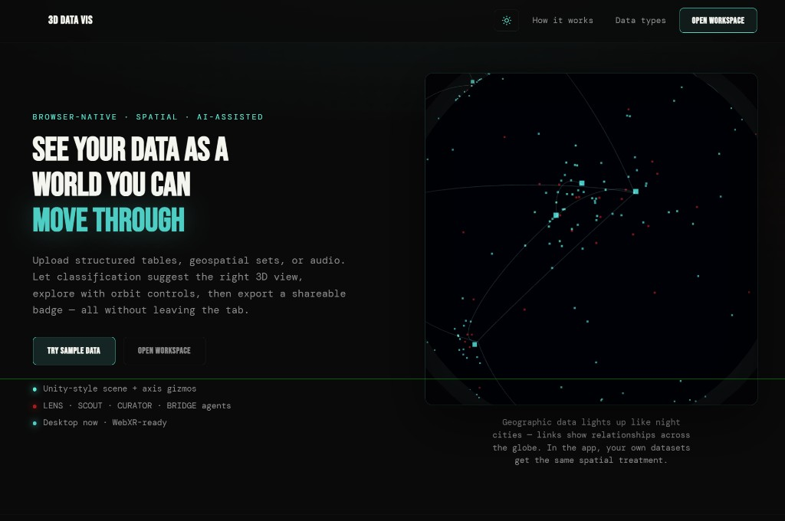
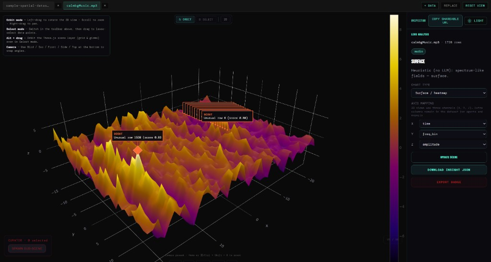

# Perspective

**A spatial canvas for data** — browser-native visualization with AI-assisted classification (LENS), anomaly highlights (SCOUT), sub-scenes (CURATOR), and export (BRIDGE). Upload tables, geospatial data, or audio; explore in 3D with orbit controls; share views or export a badge.

## Screenshots

**Landing**



**Workspace**



## Repo layout

| Path | Role |
|------|------|
| `web/` | React + Vite + R3F + Plotly SPA |
| `server/` | Optional Node AI gateway (keeps API keys off the browser) |

## Quick start (frontend)

```bash
cd web
npm install
npm run dev
```

Open the URL Vite prints (default [http://localhost:5173](http://localhost:5173)).

## Optional AI gateway

See `server/README.md`. The app can run with heuristics only; point `web` at the gateway when using LLM-backed agents.

## Scripts (web)

- `npm run build` — production build  
- `npm run lint` — ESLint  
- `npm test` — Vitest  
